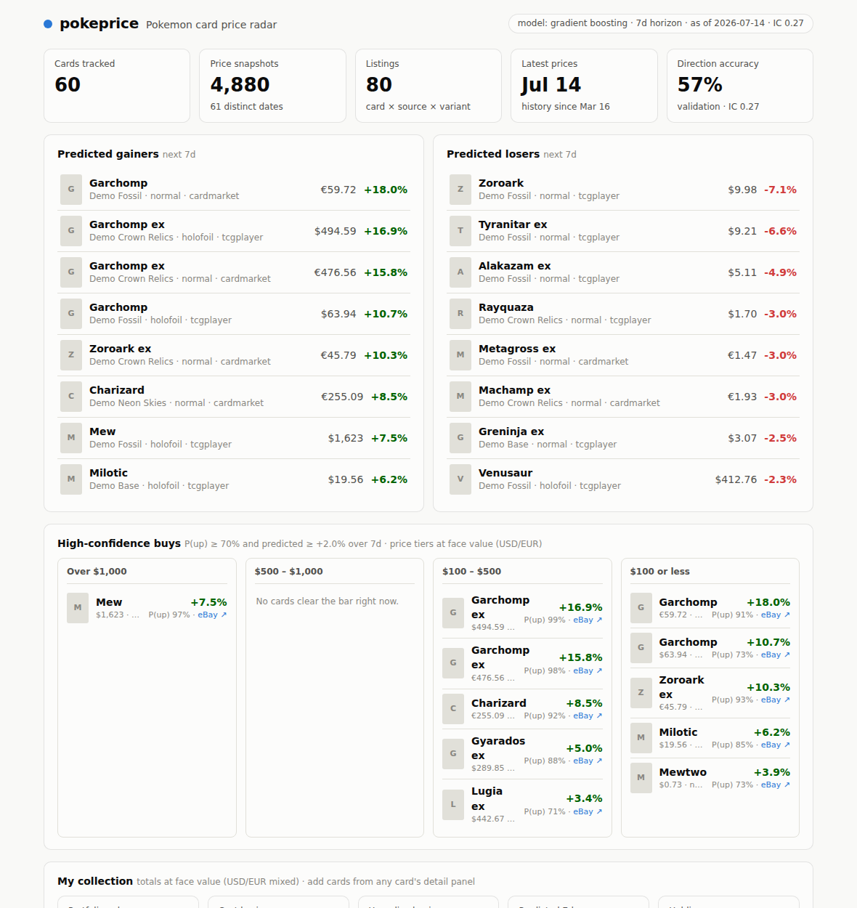
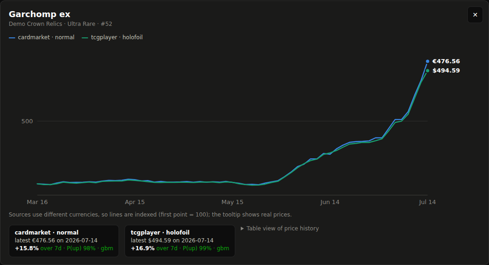

# pokeprice — Pokemon card price radar

Track Pokemon card prices over time and predict short-term price movements.
Ingest your own data dumps (`pokemon.zip` and friends), pull live prices from
the Pokemon TCG API, train a gradient-boosted model on the accumulated history,
and browse ranked "predicted movers" in a local web dashboard.



## Quickstart

```bash
pip install -e ".[dev]"

# See the whole pipeline instantly on a synthetic demo market:
pokeprice demo --reset
pokeprice train
pokeprice predict
pokeprice serve            # open http://127.0.0.1:8000
```

## Using your own data (e.g. `pokemon.zip`)

Point `ingest` at a zip, folder, CSV, or JSON — it walks everything inside
(nested folders and zips included) and auto-detects the format:

```bash
pokeprice ingest ~/Downloads/pokemon.zip
pokeprice ingest my_prices.csv --as-of 2026-07-01   # date for undated files
```

Recognized formats:

- **Pokemon TCG API / pokemon-tcg-data JSON** — card objects with
  `tcgplayer.prices` (USD) and/or `cardmarket.prices` (EUR), as bare arrays,
  `{"data": [...]}` envelopes, or per-set files with a `sets/en.json` index.
- **CSV with fuzzy column mapping** — headers like `Card Name / name / title`,
  `Market Price / price / value`, `Set`, `Rarity`, `Date`, `Low/Mid/High` are
  matched case- and punctuation-insensitively; `$`/`€` signs are stripped. The
  ingest report prints exactly which columns were mapped.

Re-ingesting the same file is idempotent — snapshots are keyed by
(card, source, variant, date). If your dump isn't recognized, `ingest` lists
the skipped files so the parser can be extended.

## Building price history (the important part)

Movement prediction needs *history*, not just current prices. Two ways to get it:

```bash
pokeprice fetch --github          # bulk one-shot: every card + current prices
pokeprice fetch --sets sv8,sv9    # or targeted API pulls (see `pokeprice sets`)
```

Then keep it fresh automatically — no cron needed:

```bash
pokeprice serve --auto-fetch daily            # fetch -> train -> predict, every day
pokeprice serve --auto-fetch 12h --auto-fetch-sets sv8,sv9   # lighter, targeted
```

The dashboard shows the auto-fetch status as a stat tile (interval, last run,
ok/failed). Prefer external scheduling? The equivalent cron line:

```cron
0 7 * * *  cd /path/to/Card-idea && pokeprice fetch --github && pokeprice predict
```

Each ingest/fetch of the same cards on a new date adds one more point to every
card's price series. Once listings have snapshots ~7 days apart, `pokeprice
train` can build real labels. An [API key](https://dev.pokemontcg.io/) via
`POKEMONTCG_API_KEY` raises the API rate limits (optional).

## How prediction works

Every observation of a listing (a card × source × variant series) on a snapshot
date becomes a feature row: trailing 1/7/30-day returns, volatility, bid–ask
spread, Cardmarket's embedded 1/7/30-day averages (momentum that works even from
a single dump), price level, rarity, set age, and history depth. The label is
the forward return to the snapshot ~`horizon` days later (default 7).

- **Model**: `HistGradientBoosting` regressor (expected return) + classifier
  (P(up)), with NaN-tolerant features and native categoricals.
- **Honest evaluation**: time-ordered split — trained on the past, validated on
  the most recent ~20% of dates. `train` reports MAE vs a predict-zero
  baseline, direction accuracy, and Spearman IC (rank correlation between
  predicted and realized returns — the "does the ranking work" number).
- **Leakage control**: trailing lookups tolerate irregular snapshot spacing but
  can never resolve to the row's own date or later.
- **Cold start**: with no trained model, `predict` falls back to a damped
  momentum heuristic, tagged `momentum` everywhere it surfaces.
- Cards under `POKEPRICE_MIN_PRICE` (default $0.25) are excluded — percentage
  moves on penny cards are bid/ask noise.

On the demo market (a momentum-y random walk with hype spikes) the model reaches
~57% direction accuracy and ~0.27 Spearman IC on the holdout — it finds the
planted signal. Real markets are harder; treat the numbers `train` prints as the
truth about your data.

## Dashboard

`pokeprice serve` gives you: stat tiles, top predicted gainers/losers,
**high-confidence buys** bucketed into four price tiers (over $1,000 ·
$500–$1,000 · $100–$500 · $100 or less — listings with P(up) ≥ 70% and a
predicted move ≥ +2%, tunable via `/api/buys?min_prob=&min_return=`), a
searchable/sortable table (price, 7d change, 30d sparkline, predicted move,
P(up)), and per-card detail with multi-series price history, crosshair tooltip,
and a table view. Light and dark mode. When a card trades in both USD
(TCGplayer) and EUR (Cardmarket), the chart indexes both series to 100 rather
than mixing currencies on one axis.



**My collection** — track what you own: add any listing from its card detail
panel (quantity + what you paid), and the dashboard shows portfolio value, cost
basis, unrealized gain, and the model's predicted 7-day move for your whole
collection, per-holding and in total.

**Buying on eBay** — every card and high-confidence pick links straight to a
targeted eBay search (fixed-price listings). With an
[eBay developer keyset](https://developer.ebay.com/) in `EBAY_CLIENT_ID` /
`EBAY_CLIENT_SECRET`, the card detail panel also pulls live listings via the
Browse API and flags each one vs your tracked market price (e.g. "-12% vs
market"). Optional: `EBAY_MARKETPLACE` (default `EBAY_US`), `EBAY_CATEGORY_ID`.

The JSON API behind it: `/api/stats`, `/api/cards`, `/api/cards/{id}`,
`/api/cards/{id}/ebay`, `/api/movers`, `/api/buys`, `/api/collection`
(interactive docs at `/docs`).

## Project layout

```
src/pokeprice/
├── ingest/          # zip/dir walker + TCG-JSON and fuzzy-CSV parsers
├── fetch.py         # live API + bulk GitHub dump fetchers
├── db.py            # SQLite schema: cards, price_snapshots, prediction runs
├── features.py      # leakage-safe trailing features + forward labels
├── model.py         # GBM train/predict + momentum fallback
├── demo.py          # synthetic demo market generator
├── cli.py           # pokeprice ingest|fetch|sets|demo|train|predict|serve|stats
└── web/             # FastAPI app + vanilla-JS dashboard
```

`data/` (database, models, downloads) is gitignored. Configuration via env vars:
`POKEPRICE_DB`, `POKEPRICE_DATA_DIR`, `POKEPRICE_MIN_PRICE`, `POKEPRICE_HORIZON`,
`POKEMONTCG_API_KEY`, `EBAY_CLIENT_ID`, `EBAY_CLIENT_SECRET`, `EBAY_MARKETPLACE`.

Run the tests with `pytest`.

## Disclaimer

Card prices are thin, hype-driven markets; a 7-day forecast from public price
feeds is a research signal, not a trading edge. **Not financial advice** — use
it to decide what to watch, not what to buy.
